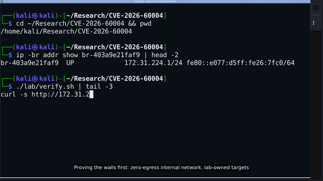
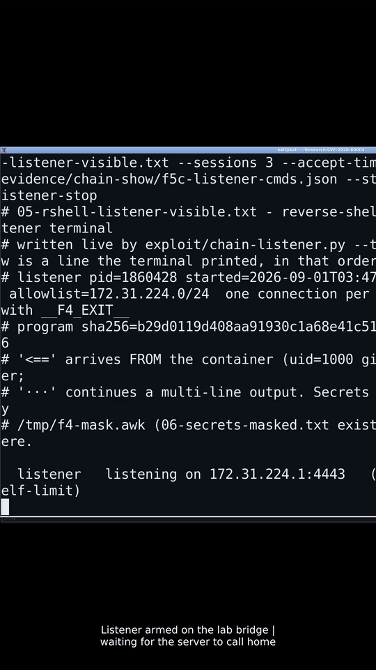
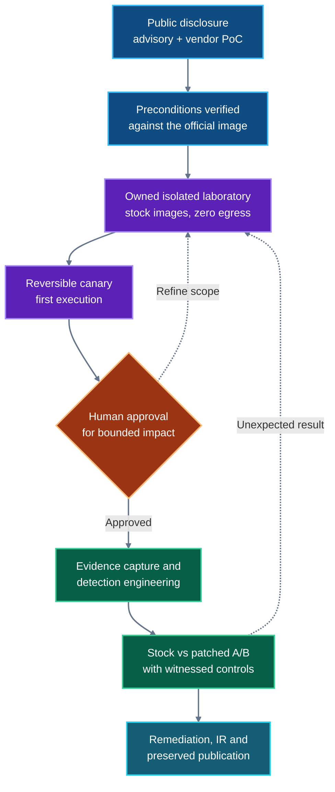

<p align="center">
  <a href="../README.md"><strong>XPECTRA RESEARCH · AUTONOMOUS RESEARCH LAB</strong></a>
</p>

# Case 002 — CVE-2026-60004

## Gitea `diffpatch` remote code execution, reconstructed for defenders

A controlled, AI-native laboratory study of the code-injection sink affecting Gitea `>=1.17, <1.27.1`. This case examines the vulnerable execution mechanism, evaluates the vendor fix against the same laboratory input, and turns the resulting evidence into detections, remediation guidance, and an incident-response package.

**This is not a discovery.** Gitea published the advisory *and a complete working proof of concept* on 2026-07-28. The discovery and the fix belong to Gitea. What this case contributes is what the public registry left unmeasured: process-level proof of what actually runs, an A/B comparison of the fix that is not vacuous, and detection content fired against recorded traffic — including one measured false positive against our own rules.

<p align="center">
  <a href="paper/CVE-2026-60004-paper.pdf">Read the paper</a> ·
  <a href="videos/main.mp4">Watch the full run</a> ·
  <a href="#defender-quickstart">Start with the detections</a> ·
  <a href="remediation.md">Review remediation</a> ·
  <a href="playbook-ir.md">Open the IR playbook</a>
</p>

> [!IMPORTANT]
> The software under test was **not modified**: the case ran against the vendor's official container images, `gitea/gitea:1.27.0` (vulnerable) and `1.27.1` (fixed), with **no code and no configuration file changes**. The images were started with the explicit parameters enumerated in [`lab/run-lab.sh`](lab/run-lab.sh) — `USER_UID`/`USER_GID`, `GITEA__security__INSTALL_LOCK=true`, addressing (`PROTOCOL`, `DOMAIN`, `HTTP_PORT`, `ROOT_URL`) and `GITEA__service__DISABLE_REGISTRATION=false` to seed the test account — each equivalent to the value a standard installation sets for itself, and none of them part of the exploit's precondition set. The three preconditions the advisory names were then verified as satisfied in the image the vendor itself publishes **without setting any precondition-related option**, which is the finding that removes the argument "it only exploits a misconfigured instance". What the laboratory added was observation instrumentation only — a canary file, planted fictional secrets, and a sampling monitor — each named in [`evidence/PROVENANCE.md`](evidence/PROVENANCE.md). The experiment therefore does **not** establish how many real deployments expose the same conditions.

> [!CAUTION]
> This case contains command-execution and reverse-shell paths for controlled analysis. Publication does not authorize testing. Use the material only in an isolated environment that you own or are explicitly authorized to test.

## Case at a glance

| Item | Case record |
|---|---|
| Product | Gitea |
| Component | `diffpatch` API route → temporary clone → Git hook execution |
| Public classification | [CWE-94 · CVSS 3.1 9.8 Critical](https://nvd.nist.gov/vuln/detail/CVE-2026-60004) (NVD marks this score **Secondary**) |
| Publicly reported conditions | Gitea `>=1.17, <1.27.1`; Git ≥ 2.32; an enabled `diffpatch` route; a writable and executable temporary filesystem |
| Threat status | [CISA KEV, added 2026-08-25](https://www.cisa.gov/known-exploited-vulnerabilities-catalog?field_cve=CVE-2026-60004) — a KEV listing *is* CISA's statement of **known exploitation in the wild**, so this CVE is treated as exploited, not merely vulnerable · remediation due 2026-08-28 (FCEB BOD 26-04) · this laboratory did not independently observe that exploitation and holds no incident details to publish |
| Fix studied | [Gitea 1.27.1](https://github.com/go-gitea/gitea/releases) · [vendor commit `d7bc52be`](https://github.com/go-gitea/gitea/commit/d7bc52beeadff4be5f5690de4d5de42abd10affe) (2026-07-26) |
| Laboratory result | Code execution as the `git` service user from a **non-admin** account, in **0.82–0.89 s** across three runs, both requests returning **HTTP 201** (silent success) |
| Experimental controls | Canary-first validation · stock-versus-patched A/B with a witnessed payload landing · live-fired detections with two benign controls |
| Defender outputs | Sigma · YARA · Suricata · IoCs · remediation · IR playbook |

## Watch the research run

Click either animated preview to open the original recording.

<table>
  <tr>
    <td align="center" width="68%">
      <a href="videos/main.mp4">
        
      </a>
    </td>
    <td align="center" width="32%">
      <a href="videos/reel.mp4">
        
      </a>
    </td>
  </tr>
  <tr>
    <td align="center">
      <strong>Full laboratory operation</strong><br>
      2:10 · 1920×1080 · <a href="videos/main.mp4">open MP4</a>
    </td>
    <td align="center">
      <strong>Vertical research brief</strong><br>
      1:15 · 1080×1920 · <a href="videos/reel.mp4">open MP4</a>
    </td>
  </tr>
</table>

The recordings are live desktop captures of the operation, not re-enactments: the commands, the output, and the latencies shown are what the run produced. They are a visual record and do not replace the process captures, control experiments, and supporting evidence in this case.

## Research boundary

| Established by this case | Evidence here | Not established by this case | What would be needed |
|---|---|---|---|
| The `diffpatch` route executes code as the `git` service user: the real parent is `git write-tree`, itself running `/bin/sh hooks/post-index-change`, `uid=1000(git)` — proven at process level, not from output text. | [`evidence/chain-worstcase/`](evidence/chain-worstcase/) · [`evidence/PROVENANCE.md`](evidence/PROVENANCE.md) | The prevalence of deployments that expose all three preconditions. | A census of real-world Gitea deployments with tmpfs mount and route configuration data. |
| All three advisory preconditions (Git ≥ 2.32, enabled `diffpatch` route, writable **and executable** temp filesystem) hold in the official `gitea/gitea:1.27.0` image **without touching configuration**. | [`designs/parent-verification.md`](designs/parent-verification.md) | Active exploitation in the wild. | Public incident reporting; none exists in the sources this case relied on, and no field telemetry was observed here. |
| The fix (1.27.1) rejects the byte-identical payload: **22/22** attempts with no execution, the second `diffpatch` returning HTTP 500 — while the monitor witnessed the payload landing on disk and the vulnerable arm executed the same payload the same day. | [`evidence/fix-verification/`](evidence/fix-verification/) (`ab-evidence.json`, unit corroboration) | That other mitigations (e.g. `noexec` tmpfs, route disabled) cannot break the chain elsewhere. | A configuration-matrix study across deployment styles; this case tested the vendor default. |
| The fix changes the temporary clone from bare to non-bare but keeps the `git apply --index --cached -3` flags — so content-based (diff-signature) detection is structurally fragile. | [`designs/fix-commit-full.diff`](designs/fix-commit-full.diff) | Universal detection coverage or production-ready tuning. | Field deployment against customer telemetry; tuning guidance is in the rule files. |
| The shipped detections fire on the recorded chain by offline pcap replay (never a live interface), **including a measured false positive**: `sid:202660041` fired on **3 of 3** legitimate cycles of a structurally benign control and now ships `confidence low`. | [`evidence/rule-fires/`](evidence/rule-fires/) · [`detection/documentation.md`](detection/documentation.md) §3.1 | | |
| A **non-admin** account, self-created through open registration, reaches the sink; delivery latency measured **0.82–0.89 s** over three runs with both requests answering **HTTP 201** (silent success — the hook's failure does not propagate to the response). | [`designs/FACTS.md`](designs/FACTS.md) §7 · [`evidence/poc-run-current-english.txt`](evidence/poc-run-current-english.txt) | | |
| Impact radius through the same primitive: `app.ini` readable, planted credentials read, arbitrary write into `/data/gitea`. | [`evidence/impact-2/`](evidence/impact-2/) · [`evidence/impact-probe-content.txt`](evidence/impact-probe-content.txt) | | |

## Research process



1. **Scope:** a publicly disclosed, vendor-remediated CVE — the vendor even published the PoC; nothing here claims discovery.
2. **Verify the premises:** check the advisory's preconditions against the image the vendor itself ships, before trusting them.
3. **Isolate:** owned laboratory, fictional domain, `--internal` network with zero egress verified at runtime.
4. **Verify safely:** a nonce-bearing canary proves execution before anything else runs.
5. **Gate impact:** bounded demonstrations (read planted secrets, write and then restore a page) behind explicit human approval; every run restores the repository.
6. **Build defenses:** detections derived from the recorded behavior, fired offline, with two benign controls — one of which caught our own false positive.
7. **Compare and preserve:** stock-versus-patched A/B whose negative is witnessed non-vacuous, then publish the failures too: the case documents its own invalid measurements and discarded attempts.

## Findings and evidence

| Finding | Evidence status | Start here |
|---|---|---|
| `diffpatch` → temp clone → `hooks/post-index-change` executes as `git`; the route's real parent chain is `git write-tree`. | Source and runtime verified | [`evidence/chain-worstcase/`](evidence/chain-worstcase/) · [`paper/`](paper/) |
| The vendor's three preconditions are active by default in the official Docker image. | Observed in the official image | [`designs/parent-verification.md`](designs/parent-verification.md) |
| The non-admin path: open registration → API token-free web session → sink, in under a second. | Observed and timed in the laboratory | [`evidence/poc-run-current-english.txt`](evidence/poc-run-current-english.txt) |
| 1.27.1 does not execute the identical payload; the negative is witnessed, not assumed (payload landed, vulnerable arm ran the same day, monitor sampled alive). | Verified with live positive control | [`evidence/fix-verification/ab-evidence.json`](evidence/fix-verification/ab-evidence.json) |
| The fix keeps the dangerous apply flags; detection by diff content is fragile by construction. | Verified against the fix diff | [`designs/fix-commit-full.diff`](designs/fix-commit-full.diff) |
| Sigma, YARA and Suricata content fired on the recorded chain by offline replay, with a measured false positive disclosed and downgraded. | Recorded in supplied transcripts | [`evidence/rule-fires/`](evidence/rule-fires/) · [`detection/documentation.md`](detection/documentation.md) |
| The advisory published a working PoC. CISA added this CVE to the KEV catalog on 2026-08-25; KEV inclusion is itself evidence of known real-world exploitation. This case did not independently observe or reproduce that exploitation, publishes no incident details, and does not estimate how prevalent it was. | Publicly reported (advisory + CISA KEV); not established by this laboratory | [GHSA-rcr6-4jqh-j84m](https://github.com/go-gitea/gitea/security/advisories/GHSA-rcr6-4jqh-j84m) · [CISA KEV](https://www.cisa.gov/known-exploited-vulnerabilities-catalog?field_cve=CVE-2026-60004) |
| Prevalence of exposed configurations in production; exploitation in the wild. | **Not established** | See [Research boundary](#research-boundary) |

## Defender quickstart

### Passive audit — recommended first step

No packets, no changes:

```bash
# 1. Version: anything >=1.17 and <1.27.1 is in the affected band.
# 2. Route present? (from the binary, not from docs):
strings /app/gitea/gitea | grep -c 'diffpatch'
# 3. Is the temp filesystem executable? Inside the container:
findmnt -no OPTIONS /tmp | grep -q noexec && echo noexec || echo EXECUTABLE
```

All three positive — version in band, route present, tmpfs executable — reproduces the precondition set the exploit needed. The remediation path is the same either way: **upgrade to ≥ 1.27.1**.

### Detection and response

- **Sigma:** [`rules/sigma/`](rules/sigma/)
- **YARA:** [`rules/yara/`](rules/yara/)
- **Suricata:** [`rules/suricata/`](rules/suricata/) — including the `confidence low` downgrade the measured false positive forced on `sid:202660041`
- **Reproduce the rule fires offline:** [`detection/run_suricata.sh`](detection/run_suricata.sh) replays the shipped pcaps (attack + two benign controls) and regenerates the transcripts in [`evidence/rule-fires/`](evidence/rule-fires/) — never against a live interface
- **Indicators:** [`ioc/CVE-2026-60004.ioc.md`](ioc/CVE-2026-60004.ioc.md) — every indicator re-derivable from an artifact in this pack
- **Remediation:** [`remediation.md`](remediation.md) · **Incident response:** [`playbook-ir.md`](playbook-ir.md)

Tune all rules against local telemetry and operational baselines before production deployment.

<details>
<summary><strong>Rebuild the controlled laboratory</strong></summary>

```bash
lab/run-lab.sh     # vulnerable (1.27.0) and patched (1.27.1) on an internal network
lab/verify.sh      # the gate: 16 checks, zero-egress proven, exit 0
```

Image pulls require network access; the running laboratory uses an internal Docker bridge with no external route, verified at runtime (`Network unreachable` to `1.1.1.1`, DNS dead). These are the vendor's stock images — no adapted build.

</details>

## Package map

| Goal | Start here | Included material |
|---|---|---|
| Understand the vulnerability | [`paper/`](paper/) | 11-page IEEEtran paper, fix study, methodology |
| Review the evidence | [`evidence/`](evidence/) | Process captures, wire pcaps, fix verification, provenance |
| Assess exposure safely | above (passive audit) | Version, route, tmpfs-executability checks |
| Deploy detections | [`rules/`](rules/) | Sigma, YARA, Suricata content |
| Investigate compromise | [`ioc/`](ioc/) · [`playbook-ir.md`](playbook-ir.md) | Indicators, triage, containment, eradication, recovery |
| Remediate | [`remediation.md`](remediation.md) | Upgrade guidance, interim mitigations, post-fix checks |
| Reproduce the experiment | [`lab/`](lab/) · [`exploit/`](exploit/) | Stock-image laboratory; stdlib canary PoC; A/B harness |
| Watch the run | [`videos/`](videos/) | Full and vertical recordings with previews |
| Verify the video | [`video-verification/`](video-verification/) | Production record, spec sheet, literal gate capture, drivers, model pin |
| Verify this pack | [`MANIFEST.sha256`](MANIFEST.sha256) · [`claim-gate-SELFTEST.md`](claim-gate-SELFTEST.md) | `sha256sum -c MANIFEST.sha256` + `./tools/validate-stage.sh` (chain of custody + the technical checks of section 7) · the self-test report of the published-number verifier (26 injected corruptions, 26 caught) |
| Reuse under its terms | [`licenses/`](licenses/) | Apache-2.0 + CC-BY-4.0 full texts, code-licensing note, third-party attributions (music, vendor images, declared fictional lab credentials) |

Validation prerequisites: Python 3 with PyYAML and Pillow, FFmpeg, YARA, Suricata, and Poppler (`pdfinfo` and `pdftotext`).

## Evidence and provenance

Case 002 is the first case produced end-to-end through the v2 research pipeline: every phase gate is a counted script rather than prose, and the numbers on this page are re-derived from artifacts by the case's published-number verifier at every freeze. That verifier's self-test caught 26 injected corruptions in 26 attempts; the report is [`claim-gate-SELFTEST.md`](claim-gate-SELFTEST.md).

The research and production pipeline was executed by AI agents operating through the Hermes harness, served by locally hosted Qwen3.8-family models — the exact served model and engine are pinned in [`video-verification/preflight.json`](video-verification/preflight.json) (`RadixArk/Qwen3.8-Flash-Next-NVFP4`, engine `sglang`) — on hardware provided by Dell Technologies through its Ambassador Program, powered by NVIDIA accelerated computing (see *Research infrastructure* in the repository README). **Miguel Zabala — Founder, Xpectra.ai · Human Research Supervisor** — defined scope, contributed offensive-security judgment, approved the bounded impact demonstration, reviewed the outputs, and authorized publication.

- **Environment:** owned laboratory, fictional domain, isolated runtime network, stock vendor images.
- **Safety model:** canary first, explicit human gate for bounded impact, restoration after testing (verified by digest).
- **Evidence:** process captures, live-fire transcripts, fix-verification records, source frames, recordings, a case-level SHA-256 manifest, and the claim-gate report; failed and invalid measurements are published in [`designs/FACTS.md`](designs/FACTS.md), not hidden.
- **AI disclosure:** models, observable actions, limitations, and resulting artifacts are disclosed. Prompt text and the model's raw API reasoning field (`reasoning_content`) are not published anywhere in this pack; what the agent put on screen while operating in the laboratory is part of the recorded film and its stills.
- **Interpretation:** the technical artifacts are retained as the research record; this README provides publication context and navigational structure.

No third-party system was scanned, accessed, or modified.

## Primary references

- [GHSA-rcr6-4jqh-j84m — Gitea advisory with published PoC](https://github.com/go-gitea/gitea/security/advisories/GHSA-rcr6-4jqh-j84m) (published 2026-07-28)
- [Gitea fix commit `d7bc52beeadff4be5f5690de4d5de42abd10affe`](https://github.com/go-gitea/gitea/commit/d7bc52beeadff4be5f5690de4d5de42abd10affe) (2026-07-26) · shipped in Gitea 1.27.1
- [NVD — CVE-2026-60004](https://nvd.nist.gov/vuln/detail/CVE-2026-60004) (published 2026-08-26; CVSS marked Secondary)
- [CISA Known Exploited Vulnerabilities Catalog](https://www.cisa.gov/known-exploited-vulnerabilities-catalog?field_cve=CVE-2026-60004) (added 2026-08-25, due 2026-08-28)

[← Back to Xpectra Research — Autonomous Research Lab](../README.md)
