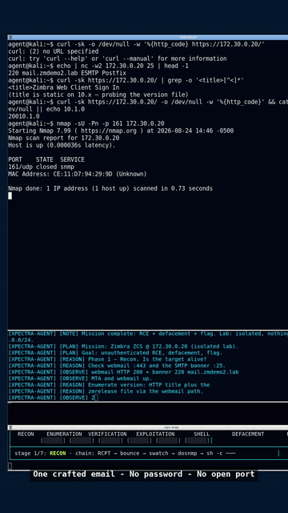
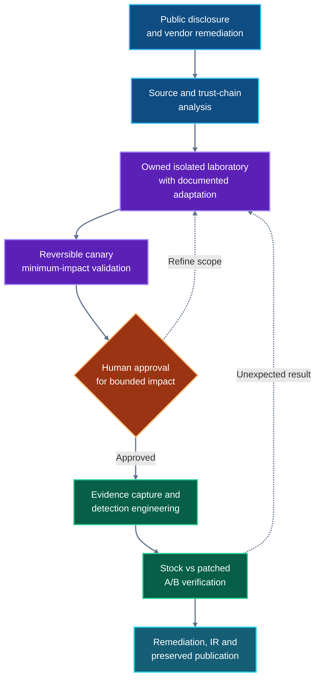

<p align="center">
  <a href="../README.md"><strong>XPECTRA RESEARCH · AUTONOMOUS RESEARCH LAB</strong></a>
</p>

# Case 001 — CVE-2026-73570

## Zimbra SNMP notification command injection, reconstructed for defenders

A controlled, AI-native laboratory study of the command-injection sink affecting Zimbra Collaboration Suite before 10.1.20. This case examines the vulnerable execution mechanism, evaluates the vendor fix against the same laboratory input, and turns the resulting evidence into detections, remediation guidance, and an incident-response package.

<p align="center">
  <a href="paper/CVE-2026-73570-paper.pdf">Read the paper</a> ·
  <a href="videos/ep02-cinematic-approved.mp4">Watch the full run</a> ·
  <a href="#defender-quickstart">Start with a passive audit</a> ·
  <a href="remediation.md">Review remediation</a> ·
  <a href="playbook-ir.md">Open the IR playbook</a>
</p>

> [!IMPORTANT]
> The laboratory adds a controlled `swatch` watch condition to feed the selected SMTP field into the vulnerable notification sink. The experiment validates sink execution, defensive telemetry, and the stock-versus-patched comparison under that condition. It does not establish that the same field-to-sink trigger path exists in an unmodified Zimbra installation.

> [!CAUTION]
> This case contains command-execution and reverse-shell paths for controlled analysis. Publication does not authorize testing. Use the material only in an isolated environment that you own or are explicitly authorized to test.

## Case at a glance

| Item | Case record |
|---|---|
| Product | Zimbra Collaboration Suite |
| Component | `zimbra-snmp` / `swatchdog` notification path |
| Public classification | [CWE-78 · CVSS 3.1 8.9 High](https://nvd.nist.gov/vuln/detail/CVE-2026-73570) |
| Publicly reported conditions | ZCS before 10.1.20, optional `zimbra-snmp` package installed, SNMP notifications enabled |
| Threat status | [CISA KEV, added 2026-08-21](https://www.cisa.gov/known-exploited-vulnerabilities-catalog?field_cve=CVE-2026-73570) · [Active exploitation reported by CERT Polska](https://moje.cert.pl/komunikaty/2026/145/aktywnie-wykorzystywana-podatnosc-w-zimbra-collaboration-suite/) |
| Fix studied | [ZCS 10.1.20](https://wiki.zimbra.com/wiki/Zimbra_Releases/10.1.20) · [vendor commit `c4837c66`](https://github.com/Zimbra/zm-build/commit/c4837c66360979d757890271f6c976727e71bcad) |
| Laboratory result | Controlled command execution as the `zimbra` service user under the documented adaptation |
| Experimental controls | Canary-first validation · stock/patched A/B comparison · isolated runtime network |
| Defender outputs | Detector · Sigma · YARA · Suricata · IoCs · remediation · IR playbook |

## Watch the research run

Click either animated preview to open the original recording.

<table>
  <tr>
    <td align="center" width="68%">
      <a href="videos/ep02-cinematic-approved.mp4">
        
      </a>
    </td>
    <td align="center" width="32%">
      <a href="videos/ep02-reel-approved.mp4">
        
      </a>
    </td>
  </tr>
  <tr>
    <td align="center">
      <strong>Full laboratory operation</strong><br>
      3:45 · 1920×1080 · <a href="videos/ep02-cinematic-approved.mp4">open MP4</a>
    </td>
    <td align="center">
      <strong>Vertical research brief</strong><br>
      1:29 · 1080×1920 · <a href="videos/ep02-reel-approved.mp4">open MP4</a>
    </td>
  </tr>
</table>

The recordings preserve the adapted laboratory run. They are a visual research record, not a substitute for the process captures, control experiments, and supporting evidence included in this case.

## Research boundary

| Established by this case | Not established by this case |
|---|---|
| The tested legacy `doSNMP()` sink constructs a shell-interpreted command using Perl backticks. | That the documented SMTP field reaches the sink in an unmodified installation. |
| The adapted laboratory chain produced canary and bounded command execution as `zimbra`. | The prevalence of this exact trigger path in production environments. |
| The patched implementation did not execute the identical canary while the stock positive control remained valid. | Independent observation of exploitation in the wild; that is attributed to public reporting. |
| Included detections matched artifacts from the recorded laboratory execution. | Universal detection coverage or production-ready tuning for every environment. |

## Research process



1. **Scope:** constrain the work to a publicly disclosed and vendor-remediated vulnerability.
2. **Analyze:** inspect the source, trust boundaries, notification path, and vendor change.
3. **Isolate:** construct an owned laboratory with fictional identities and no runtime egress.
4. **Verify safely:** establish execution first with a reversible canary.
5. **Demonstrate deliberately:** gate higher-impact behavior behind explicit human approval.
6. **Build defenses:** derive host, log, network, and file detections from recorded behavior.
7. **Test and preserve:** compare stock and patched paths, retain evidence, and publish limitations alongside results.

## Findings and evidence

| Finding | Evidence status | Start here |
|---|---|---|
| The tested legacy `doSNMP()` path passes interpolated data through a shell-interpreted command. | Source and runtime verified | [`paper/`](paper/) · [vendor patch](https://github.com/Zimbra/zm-build/commit/c4837c66360979d757890271f6c976727e71bcad) |
| The added watch condition carried the crafted recipient field into the vulnerable sink. | Observed in the adapted laboratory | [`evidence/shell-session-v4.txt`](evidence/shell-session-v4.txt) |
| The controlled chain executed a canary and bounded impact demonstration as `zimbra`. | Observed in the adapted laboratory | [`evidence/`](evidence/) · [`videos/`](videos/) |
| The patched multi-argument `system()` path did not execute the identical canary while the stock arm did. | Verified with a live positive control | [`patched-lab-report.md`](evidence/fix-verification/patched-lab-report.md) |
| Sigma, YARA, and Suricata content matched the recorded laboratory artifacts. | Recorded in supplied transcripts | [`evidence/rule-fires/`](evidence/rule-fires/) |
| Active exploitation occurred in the wild. | Publicly reported; not independently observed here | [CERT Polska](https://moje.cert.pl/komunikaty/2026/145/aktywnie-wykorzystywana-podatnosc-w-zimbra-collaboration-suite/) · [CISA KEV](https://www.cisa.gov/known-exploited-vulnerabilities-catalog?field_cve=CVE-2026-73570) |
| The same SMTP trigger path exists on an unmodified installation. | **Not established** | See [Research boundary](#research-boundary) |

## Defender quickstart

### Passive audit — recommended

Run from the case directory. This mode sends no packets and makes no changes:

```bash
python3 detection/detect_snmp_sink.py --audit
```

Use it first to review the installed version, notification configuration, and relevant sink conditions.

### Detection and response

- **Sigma:** [`rules/sigma/`](rules/sigma/)
- **YARA:** [`rules/yara/`](rules/yara/)
- **Suricata:** [`rules/suricata/`](rules/suricata/)
- **Indicators:** [`ioc/`](ioc/)
- **Remediation:** [`remediation.md`](remediation.md)
- **Incident response:** [`playbook-ir.md`](playbook-ir.md)

Tune all rules against local telemetry and operational baselines before production deployment.

<details>
<summary><strong>Authorized active canary — adapted laboratory only</strong></summary>

This sends one crafted laboratory message and checks for a single canary file. It is an active validation, not a passive audit.

```bash
python3 detection/detect_snmp_sink.py --active 172.30.0.20 \
    --verify-cmd "docker exec zmdemo-snmp test -f /tmp/cve-73570-canary"
```

Run this example only against the supplied isolated laboratory or an equivalently authorized test environment.

</details>

<details>
<summary><strong>Rebuild the controlled laboratory</strong></summary>

```bash
cd lab
./build-lab.sh
./verify.sh
```

Provisioning requires network access to obtain permitted dependencies. The running experiment uses an internal Docker bridge with no external route.

This build reproduces the documented adapted research environment; it is not a stock-deployment reproduction.

</details>

## Package map

| Goal | Start here | Included material |
|---|---|---|
| Understand the vulnerability | [`paper/`](paper/) | Paper, source analysis, methodology, and fix study |
| Review the evidence | [`evidence/`](evidence/) | Process capture, figures, rule fires, and fix verification |
| Assess exposure safely | [`detection/`](detection/) | Passive audit and authorized laboratory canary |
| Deploy detections | [`rules/`](rules/) | Sigma, YARA, and Suricata content |
| Investigate compromise | [`ioc/`](ioc/) · [`playbook-ir.md`](playbook-ir.md) | Indicators, triage, containment, eradication, and recovery |
| Remediate | [`remediation.md`](remediation.md) | Upgrade guidance, interim mitigations, and post-fix checks |
| Reproduce the experiment | [`lab/`](lab/) | Container build, initialization, and verification |
| Inspect offensive mechanics | [`exploit/`](exploit/) | Preserved laboratory exploit code; authorized use only |
| Watch the run | [`videos/`](videos/) | Full and vertical recordings with lightweight previews |

## Evidence and provenance

Case 001 is the retrospective baseline of the Autonomous Research Lab. The initial investigation ran for a little over two days.

The research and production pipeline was executed by AI agents powered by **Qwen3.8-27B-FP8** and **DeepSeek-V4-Flash-0731**. **Miguel Zabala — Founder, Xpectra.ai · Human Research Supervisor** — defined scope, contributed offensive-security judgment, requested clarifications, approved the controlled impact demonstration, reviewed the output, and authorized publication.

- **Environment:** owned laboratory, fictional domain, isolated runtime network.
- **Safety model:** canary first, explicit human gate for bounded impact, restoration after testing.
- **Evidence:** process captures, live-fire transcripts, fix-verification records, source frames, recordings, and a case-level SHA-256 manifest.
- **AI disclosure:** models, observable actions, limitations, and resulting artifacts are disclosed; prompts and private reasoning traces are not published.
- **Interpretation:** the technical artifacts are retained as the research record; this README provides publication context and navigational structure.

No third-party system was scanned, accessed, or modified.

## Primary references

- [Zimbra security advisories](https://wiki.zimbra.com/wiki/Zimbra_Security_Advisories)
- [Zimbra 10.1.20 patch release](https://wiki.zimbra.com/wiki/Zimbra_Releases/10.1.20)
- [Zimbra fix commit `c4837c663609`](https://github.com/Zimbra/zm-build/commit/c4837c66360979d757890271f6c976727e71bcad)
- [NVD — CVE-2026-73570](https://nvd.nist.gov/vuln/detail/CVE-2026-73570)
- [CISA Known Exploited Vulnerabilities Catalog](https://www.cisa.gov/known-exploited-vulnerabilities-catalog?field_cve=CVE-2026-73570)
- [CERT Polska advisory 145/2026](https://moje.cert.pl/komunikaty/2026/145/aktywnie-wykorzystywana-podatnosc-w-zimbra-collaboration-suite/)

[← Back to Xpectra Research — Autonomous Research Lab](../README.md)
