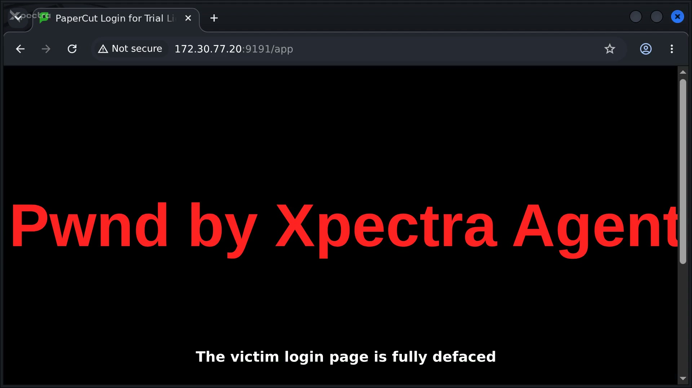
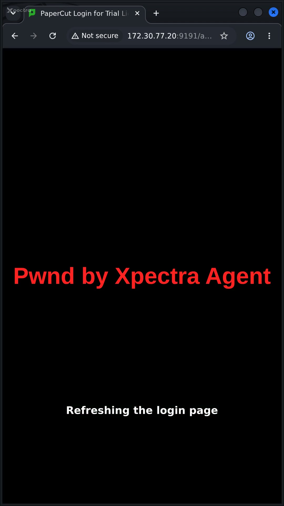
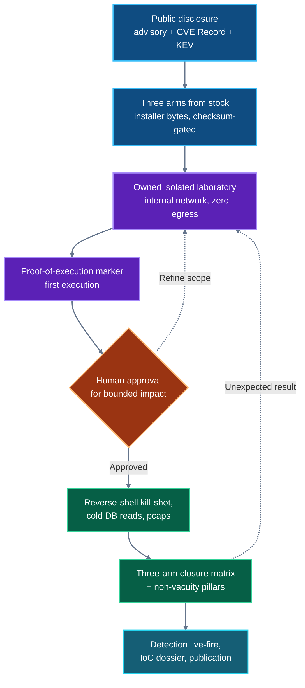

<p align="center">
  <a href="../README.md"><strong>XPECTRA RESEARCH · AUTONOMOUS RESEARCH LAB</strong></a>
</p>

# Case 003 — CVE-2026-82078

## PaperCut NG/MF: authentication-bypass to unsafe-driver-loading chain (companion CVE-2026-81578), reconstructed for defenders

A controlled, AI-native laboratory study of the two-CVE chain affecting PaperCut NG/MF *from 0 before 24.1.10 / 25.0.13 / 26.0.5*. This case reproduces the full chain on stock vendor bytes, measures **which fixed build kills it and where**, locates the fix without any decompiler, and ships a detection package whose rules were live-fired or cut — with the false-positive behavior measured, not asserted.

**This is not a discovery.** PaperCut published the advisory on 2026-08-27; both CVEs were assigned 2026-08-28; a full-chain Metasploit module merged 2026-09-03. The discovery, the mechanism write-up and the fix belong to PaperCut and its reporters. What this case contributes is what the public registry left unmeasured: a same-day three-arm closure matrix (25.0.11 vulnerable / 25.0.12-PO-4560.76533 emergency patch / 25.0.13 maintenance release) whose negatives are proven non-vacuous, mechanism location from shipped artifacts only (closed source — no decompiler used), a unit corroboration showing the fix closes the *path*, not the payload artifact, and the first published fired detection set for this chain (the public surface was empty at intake).

<p align="center">
  <a href="paper/CVE-2026-82078-paper.pdf">Read the paper</a> ·
  <a href="videos/main.mp4">Watch the full run</a> ·
  <a href="#defender-quickstart">Start with the detections</a> ·
  <a href="ioc/CVE-2026-82078.ioc.md">Open the IoC dossier</a>
</p>

> [!IMPORTANT]
> The software under test was **not modified**: the laboratory was built from the three stock vendor installers, byte-verified against the vendor bulletin's published SHA-256 where the vendor publishes one (the 25.0.13 row MATCHes; the older-build hash is recorded as our custody datum; the EPR3 row MATCHes the vendor's Wayback-documented row). The chain's trigger set needs **zero credentials and zero configuration changes** on the vulnerable arm — that is what the companion CVE is for. What the laboratory added was observation instrumentation only (a proof-of-execution marker file under `/tmp`, a read-only cold read of the internal database, process sampling), each named in the run manifests under [`evidence/`](evidence/). Vocabulary note: the internal capture name of the proof-of-execution marker survives in raw evidence file names and rule ids as a capture-path token; published prose calls it what it is — a minimal proof-of-execution payload.

> [!CAUTION]
> This case contains an authenticated-free remote code execution chain and its PoC, for controlled analysis. Publication does not authorize testing. Use the material only in an isolated environment that you own or are explicitly authorized to test.

## Case at a glance

| Item | Case record |
|---|---|
| Product | PaperCut NG / PaperCut MF |
| Component | Tapestry management interface (CVE-2026-81578) → `user-lookup.db-driver` in `tbl_config` → unsafe dynamic class loading in the database connector (CVE-2026-82078, CWE-470 unsafe reflection) |
| Public classification | CVSS v4.0: 81578 = 8.8 HIGH (CNA), 82078 = 9.4 CRITICAL (CNA); NVD assigns its own v3.1 9.8 / 9.1 — both recorded verbatim, neither blended |
| Threat status | [CISA KEV, both CVEs added 2026-08-31](https://www.cisa.gov/known-exploited-vulnerabilities-catalog?field_cve=CVE-2026-82078) — a KEV listing *is* CISA's statement of **known exploitation in the wild**, so this chain is treated as exploited, not merely vulnerable · remediation due 2026-09-14 (FCEB BOD 26-04) · this laboratory did not independently observe that exploitation and holds no incident details to publish |
| Fix studied | Maintenance releases 24.1.10 / 25.0.13 / 26.0.5 (published 2026-09-10, replacing emergency patch releases EPR1–EPR3); fix commit **not public** (closed source) — verification is behavioral A/B plus shipped-artifact inspection, no decompilation |
| Laboratory result | Full chain on stock 25.0.11.75758: unauthenticated forged request rewrites the DB-driver config, a hand-assembled **977-byte** proof-of-execution class already on the classpath loads, code runs as `uid=1000(papercut)`; restore-to-factory proven by cold database reads on repeat runs |
| Closure matrix (measured) | 25.0.11 **FIRES** · EPR3 25.0.12-PO-4560.76533 **dies at step 3/11** (302 bounce of the forged request) · 25.0.13 **dies at step 3/11** — same-day runs, unmodified exploit bytes, five-pillar gate returned **VALID 5/5** |
| Experimental controls | Proof-of-execution marker first · cold pre/post database reads · negative control on the patched arm · same-day positive controls · witnessed-inertness corroboration inside the fixed build |
| Defender outputs | Suricata · Sigma · YARA · host-audit script · IoC dossier · vendor-IoC cross-map (every rule fired or cut, cuts documented) |

## Watch the research run

Direct links to the two shipped recordings; the table images are frames extracted from them (provenance: [`evidence/figures/VIDEO-THUMBS.md`](evidence/figures/VIDEO-THUMBS.md)).

<table>
  <tr>
    <td align="center" width="68%">
      <a href="videos/main.mp4">
        
      </a>
    </td>
    <td align="center" width="32%">
      <a href="videos/reel.mp4">
        
      </a>
    </td>
  </tr>
  <tr>
    <td align="center">
      <strong>Full laboratory operation</strong><br>
      2:12 · 1920×1080 · <a href="videos/main.mp4">open MP4</a>
    </td>
    <td align="center">
      <strong>Vertical research brief</strong><br>
      1:29 · 1080×1920 · <a href="videos/reel.mp4">open MP4</a>
    </td>
  </tr>
</table>

The recordings are live desktop captures (one landscape take `t4-show` for the film; the reel shot natively portrait as `t5-reel`), not re-enactments: the commands, output and latencies shown are what the run produced. The production gate counted **32/32** on the shipped pair, the anti-vacuity battery T1–T5 refused every wrong-film control, and 15 on-screen claims are frame-audited with signed stills — Per the operator strict-publication ruling of 2026-09-11 the production record itself (capture drivers, counted gate captures, signed audit stills, take metadata, model pin) is held with the case research pack, not shipped here; the machine-readable claim bindings ship in this pack at [`claims-video.json`](claims-video.json). See [`videos/README.md`](videos/README.md).

## The chain, in three sentences

CVE-2026-81578 lets an unauthenticated remote request reach a Tapestry "complex direct" service path **before** access validation completes, so a forged POST writes system configuration. CVE-2026-82078 then makes the database connector instantiate whatever driver class name the configuration names — no allowlist — via `Class.forName` before connecting, so pointing `user-lookup.db-driver` at a class already resident on the application classpath executes its static initializer as the PaperCut service user. Chained: one unauthenticated HTTP session becomes arbitrary Java bytecode execution inside the service account, with no file upload and no credentials. The measured kill-shot parentage (sh `getppid` = the `pc-app` JVM) and the restore-to-factory cold reads are in [`evidence/run-04c-rshell-20260911T170937Z/`](evidence/run-04c-rshell-20260911T170937Z/).

## Research boundary

| Established by this case | Evidence here | Not established by this case | What would be needed |
|---|---|---|---|
| The full chain executes on stock 25.0.11.75758 with zero credentials: version oracle → forged complex-direct write to `tbl_config` → driver-class load → code as `uid=1000(papercut)`, proven at process level (`sh` parent = the `pc-app` JVM), not from output text. | [`evidence/run-04c-rshell-20260911T170937Z/`](evidence/run-04c-rshell-20260911T170937Z/) · [`evidence/processes/`](evidence/processes/) | The prevalence of exposed PaperCut deployments in the wild. | A census of real deployments; this case tested one stock installation shape. |
| The chain **dies at step 3/11 on both fixed arms** (EPR3 and the maintenance release): the forged request is 302-bounced to the login page, the internal config stays byte-identical on cold pre/post reads — same-day, unmodified exploit bytes, five-pillar non-vacuity gate `VALID 5/5`. | [`evidence/phase05/`](evidence/phase05/) (`ab_gate-output-20260911T181312Z.txt`, `pillars/`) | Whether any interim emergency-patch revision is bypassable beyond what is publicly documented (the corroborated bypass claims concern EPR1 only). | Byte-level comparison of every EPR revision — EPR1 bytes are no longer downloadable, and this lab did not re-derive that history. |
| The fix physically lives in the shipped `WEB-INF/papercut.application` service overrides (`ValidatingDirectService` / `ValidatingActionService`), with the vendored Tapestry engine jars hash-identical across all arms — mechanism location **without decompilation**; and the payload artifact itself still executes when force-loaded inside the fixed build, so the fix closes the *path*, not the artifact. | [`evidence/phase05/static/wp4c-application-spec-diff.txt`](evidence/phase05/static/wp4c-application-spec-diff.txt) · [`evidence/phase05/unit-corr-epr3-20260911T174916Z/`](evidence/phase05/unit-corr-epr3-20260911T174916Z/) | That no other code path reaches the same sink. | Full source audit, which the closed-source boundary forecloses; the paper's static work enumerates what was checked. |
| The shipped detections fire on the recorded chain — Suricata by offline pcap replay and by fresh in-lab live capture+replay, Sigma by local evaluation against a derived event stream, YARA against artifact extracts — **with measured cuts**: an attempt-level wire rule that provably fires on patched arms too was relabeled honestly, and every rule carries its fire or cut record. | [`evidence/rule-fires/`](evidence/rule-fires/) · [`detection/sigma-fires.md`](detection/sigma-fires.md) | Universal detection coverage or production-ready tuning. | Field deployment against customer telemetry; tuning guidance ships in the rule files. |
| The public record: advisory 2026-08-27; CVEs 2026-08-28; KEV both CVEs 2026-08-31, due 2026-09-14; vendor IoCs published 2026-08-30; Metasploit full-chain module 2026-09-03. KEV inclusion is itself evidence of known real-world exploitation. This case did not independently observe or reproduce that exploitation and publishes no incident details. | Publicly reported (advisory + CVE Record + CISA KEV), captured verbatim in [`evidence/raw-research/`](evidence/raw-research/) | | See [Primary references](#primary-references) |

## Research process



1. **Scope:** a publicly disclosed, vendor-remediated, KEV-listed chain — the vendor published mechanism and IoCs; a public PoC exists; nothing here claims discovery.
2. **Build stock, prove stock:** three arms (vulnerable / emergency-patch / maintenance release) from installer bytes, vendor-bulletin checksums verified programmatically — an intake gate that caught our own wrong-row selection and logged it.
3. **Isolate:** owned laboratory, fictional `*.lab` domain, Docker `--internal` network, no default route, verified at runtime by the 25-check lab gate (`25 ok, 0 fail`).
4. **Verify safely:** the minimal proof-of-execution payload writes one marker file before anything else runs; the same bytes are used for every arm (md5 pinned in the run manifests).
5. **Gate impact:** bounded demonstrations (marker file, one reverse shell with typed read-only commands, a reversible CSS defacement of the login page) behind explicit human approval; every run restores the configuration to factory, proven by cold database reads.
6. **Measure closure, not just exploit:** three arms, same day, same bytes, five non-vacuity pillars per negative — cold pre/post reads, live positive controls, witnessed inertness.
7. **Fire or cut the detections,** publish the cuts, and publish the failures too: the 49-entry attempt log is part of the record, not an appendix.

## Findings and evidence

| Finding | Evidence status | Start here |
|---|---|---|
| End-to-end reproduction on stock 25.0.11 with restore-to-factory proven by cold reads, on repeat runs. | Observed and process-proven | [`evidence/run-04c-rshell-20260911T170937Z/`](evidence/run-04c-rshell-20260911T170937Z/) · [`paper/`](paper/) |
| The three-arm closure matrix: fires on 25.0.11, dies at step 3 (302 bounce) on EPR3 and on 25.0.13, with the five-pillar gate returning VALID. | Verified with live positive controls | [`evidence/phase05/ab_gate-output-20260911T181312Z.txt`](evidence/phase05/ab_gate-output-20260911T181312Z.txt) |
| Fix located without decompilers: `papercut.application` service-override diff (stock vs fixed, the two fixed arms byte-identical), Tapestry engine jars hash-identical across all arms. | Verified against shipped artifacts | [`evidence/phase05/static/`](evidence/phase05/static/) |
| Unit corroboration inside the fixed build: the exact PoC class bytes still run when force-loaded — the fix closes the authorization path, not the executable artifact. | Verified in-container on the EPR3 arm | [`evidence/phase05/unit-corr-epr3-20260911T174916Z/`](evidence/phase05/unit-corr-epr3-20260911T174916Z/) |
| Latency anatomy of the chain: the two config-writing requests and their timing, from the exploit's own run record (full table in the paper). | Measured | [`paper/CVE-2026-82078-paper.pdf`](paper/CVE-2026-82078-paper.pdf) §IV |
| Suricata rules fire on the recorded chain offline **and** on fresh in-lab captures; a rule that fires on patched arms too was relabeled at attempt level; Sigma/YARA carry their fire transcripts. | Recorded in supplied transcripts | [`evidence/rule-fires/`](evidence/rule-fires/) · [`detection/`](detection/) |
| The CWE classification conflict (CWE-305 vs CWE-306 for 81578) is **internal to the vendor's own artifacts** — CVE Record vs advisory/KEV — recorded verbatim, no winner invented. | Primary captures | [`evidence/raw-research/`](evidence/raw-research/) · paper §II |

## Defender quickstart

### Passive audit — recommended first step

No packets, no changes:

```bash
# 1. Version band: every PaperCut NG/MF before 24.1.10 / 25.0.13 / 26.0.5 is affected.
#    The login page footer states the version and build.
# 2. Has anyone already been here? Search the server log for the vendor's own strings
#    (also emitted by our lab chain — they are attacker-shape, not lab-specific):
grep -E "No suitable driver found for jdbc:no:x|Database error looking up cardID|jdbc:derby:memory:" \
     /usr/local/papercut/server/logs/server.log
# 3. Did the user-lookup DB keys change? (factory: driver/url empty, enabled=N)
#    See the run manifests' COLD-read procedure for the offline method.
```

Any hit: treat as compromise — the config change is the foothold, not the payload. The remediation path is the same either way: **upgrade to ≥ 24.1.10 / 25.0.13 / 26.0.5** (the maintenance releases replace all emergency patches; this lab measured EPR3 and the MR closing the chain identically at the same step).

### Detection and response

- **Suricata:** [`detection/rules/suricata/`](detection/rules/suricata/) — 7 CVE rules + one sensor-health rule (a decoder-alive indicator, explicitly *not* a finding; it makes every zero-alert negative control non-vacuous)
- **Sigma:** [`detection/rules/sigma/`](detection/rules/sigma/) — process-lineage and log-shape rules, each with its fire/cut record
- **YARA:** [`detection/rules/yara/`](detection/rules/yara/) — artifact remnants (memory-DB boot block, config-shape strings); lab-trace rules are labelled LAB-TRACE and excluded from the finding set
- **Host audit (read-only):** `python3 detection/detect_papercut_82078.py --audit` against your instance
- **Reproduce the rule fires offline:** [`detection/run_suricata.sh`](detection/run_suricata.sh) replays the shipped pcaps and regenerates the transcripts under [`evidence/rule-fires/`](evidence/rule-fires/) — never against a live interface
- **Indicators:** [`ioc/CVE-2026-82078.ioc.md`](ioc/CVE-2026-82078.ioc.md) — vendor IoCs cross-mapped to lab-shaped equivalents; every indicator re-derivable from an artifact in this pack; hunt the *shape*, not our file names

Tune all rules against local telemetry and operational baselines before production deployment.

<details>
<summary><strong>Rebuild the controlled laboratory</strong></summary>

```bash
lab/fetch-arms.sh          # stock 25.0.11 + patched 25.0.13 installers (vendor CDN)
lab/fetch-epr3.sh          # emergency-patch arm 25.0.12-PO-4560.76533
lab/build-lab.sh stock     # Docker arm from the stock installer (free-tier license)
lab/verify.sh stock        # the gate: 25 checks, internal-network isolation proven
```

The installers (~900 MB each) are fetched from the vendor CDN and are **not redistributed** in this pack; the arm table and network (`172.30.77.0/24`, Docker `--internal`) come from the case configuration. `lab/install-params.properties` carries the FICTIONAL laboratory admin credential (`admin / Lab003-Papercut!`, declared in [`licenses/ATTRIBUTION.md`](licenses/ATTRIBUTION.md)).

</details>

## Package map

| Goal | Start here | Included material |
|---|---|---|
| Understand the chain | [`paper/`](paper/) | 12-page IEEEtran paper (incl. PoC walkthrough with on-screen stills): chain anatomy, closure matrix, mechanism location, detection, honest limitations |
| Review the evidence | [`evidence/`](evidence/) | Run manifests, process trees, cold DB reads, pcaps, campaign hash lists, provenance captures |
| See the fix study | [`evidence/phase05/`](evidence/phase05/) | three-arm gate output, `papercut.application` diff, unit corroboration |
| Deploy detections | [`detection/`](detection/) | Suricata, Sigma, YARA, host-audit script, fire/cut records |
| Investigate compromise | [`ioc/CVE-2026-82078.ioc.md`](ioc/CVE-2026-82078.ioc.md) | Vendor IoCs + lab cross-map, hunt guidance |
| Reproduce the experiment | [`lab/`](lab/) · [`exploit/`](exploit/) | Stock-installer laboratory; stdlib PoC (dry-run + reverse-shell + deface modes); offline test suite with golden captures |
| Watch the run | [`videos/`](videos/) | The two shipped recordings — nothing else (strict publication ruling, 2026-09-11; file integrity via the root manifest) |
| Verify the video | [`claims-video.json`](claims-video.json) | Machine-readable frame-claim spec: every on-screen claim binds to terminal text inside the shipped films; the counted production captures (GATE-V2 31/31, battery T1–T5, frame audit 15/15 + signed stills, model pin) are held with the case research pack — declared in [`videos/README.md`](videos/README.md) |
| Verify this pack | [`MANIFEST.sha256`](MANIFEST.sha256) · [`claim-gate-GATE.md`](claim-gate-GATE.md) | `sha256sum -c MANIFEST.sha256` + `./tools/validate-stage.sh` (chain of custody + the technical checks) · the counted claim-gate report (30/30) the published numbers were checked against |
| Reuse under its terms | [`licenses/`](licenses/) | Apache-2.0 + CC-BY-4.0 full texts, code-licensing note, third-party attributions (CC0 music with its license proof, vendor material, declared fictional lab credentials) |

## Honest records

This case publishes its own failures. The 49-entry [`attempt-log.md`](attempt-log.md) is the scientific record: an intake checksum gate that correctly reported MISMATCH against the wrong vendor bulletin row (#1), a confabulated sink location caught by self-audit before anything consumed it (#2), a rebuild that destroyed a green container mid-run (#5), locked-database reads invalidated and replaced by cold reads (#8), harness-side capture defects in two of three kill-shot runs — the chain succeeded all three times, the *capture* had to be re-earned (#12), and the whole video production cycle including the re-shoot ruling, the publication staging and its strict-videos correction and the v3 operator-refinement cycle (#18–#43). The lesson of #33–#36, kept because it stings: the parent reviewer's OCR blindness to a correctly-rendered on-screen claim was an environmental artifact (thread-pool spin + light-on-light contrast), and the honest arbitration came from re-measuring with the auditor's own instrument, not from defending a conclusion. Invalid measurements stay in their directories marked INVALID; nothing was rewritten.

## Evidence and provenance

Case 003 is the third case produced end-to-end through the v2 research pipeline: every phase gate is a counted script, and the numbers on this page were re-derived from artifacts by the case claim gate — `claims=32 checks=32 pass=32 fail=0` ([`claim-gate-GATE.md`](claim-gate-GATE.md)), with the paper's 12 pages audited page-by-page in [`evidence/paper-audit/report.md`](evidence/paper-audit/report.md).

The research and production pipeline was executed by AI agents operating through the Hermes harness, served by locally hosted models — the exact served model and engine are pinned in the pack-side production record (not published, see [`videos/README.md`](videos/README.md)) — on hardware provided by Dell Technologies through its Ambassador Program, powered by NVIDIA accelerated computing (see *Research infrastructure* in the repository README). **Miguel Zabala — Founder, Xpectra.ai · Human Research Supervisor** — defined scope, contributed offensive-security judgment, approved the bounded impact demonstrations and the video re-shoot ruling, reviewed the outputs, and authorized publication.

- **Environment:** owned laboratory, fictional `*.lab` domain, Docker `--internal` network (`172.30.77.0/24`), stock vendor installers, free-tier license — three arms, one up at a time under RAM governance.
- **Safety model:** proof-of-execution marker first, explicit human gate for bounded impact, restore-to-factory after every run (verified by cold database read), a hard subnet guard in the PoC that refuses any target outside the laboratory range.
- **Evidence:** run manifests (every artifact carries the command that produced it + UTC stamp), process trees, pcaps, campaign SHA-256 lists, live-fire transcripts, fix-verification records, signed frame stills, the case-level manifest.
- **AI disclosure:** models, observable actions, limitations, and resulting artifacts are disclosed. Prompt text and the model's raw API reasoning field are not published anywhere in this pack; what the agent put on screen while operating in the laboratory is part of the recorded film and its stills.
- **Interpretation:** the technical artifacts are retained as the research record; this README provides publication context and navigational structure.

No third-party system was scanned, accessed, or modified.

## Primary references

- [PaperCut Security Bulletin, 27 Aug 2026 (urgent advisory)](https://www.papercut.com/kb/Main/security-bulletin-27-aug-2026-urgent-security-advisory/) — mechanism, CVSS, fixed versions, per-installer SHA-256, vendor IoCs (verbatim captures in [`evidence/raw-research/`](evidence/raw-research/))
- [CVE-2026-81578 — PaperCut MF/NG: Authentication Bypass](https://nvd.nist.gov/vuln/detail/CVE-2026-81578) · [CVE-2026-82078 — PaperCut MF/NG: Unsafe Dynamic Class Loading in Database Connector](https://nvd.nist.gov/vuln/detail/CVE-2026-82078) (published 2026-08-28)
- [CISA Known Exploited Vulnerabilities Catalog](https://www.cisa.gov/known-exploited-vulnerabilities-catalog?field_cve=CVE-2026-82078) (both CVEs added 2026-08-31, due 2026-09-14)
- [Rapid7 analysis of the exploitation](https://www.rapid7.com/blog/post/rapid7-analysis-actively-exploited-papercut-missing-auth-flaw-leads-to-rce) (2026-08-28) · [Huntress reproduction](https://www.huntress.com/blog/papercut-actively-exploited) (2026-08-28) · [Metasploit module `papercut_ng_external_user_lookup_rce.rb`](https://github.com/rapid7/metasploit-framework) (merged 2026-09-03)

[← Back to Xpectra Research — Autonomous Research Lab](../README.md)
