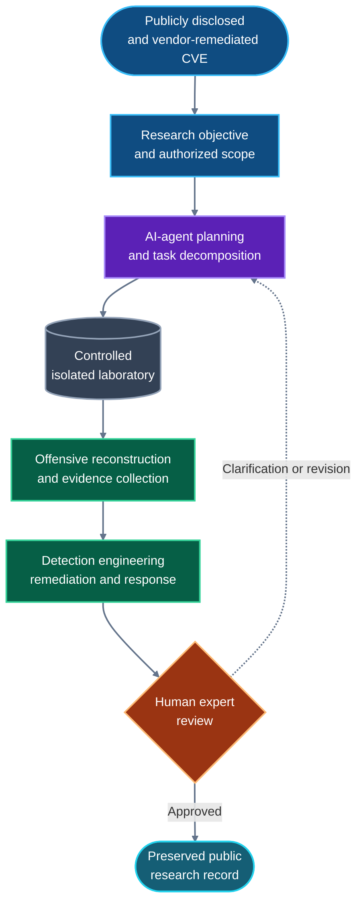

# Xpectra Research — Autonomous Research Lab

**AI-native vulnerability research. Human-governed scope. Defender-focused outcomes.**

[Xpectra.ai](https://xpectra.ai) created the Autonomous Research Lab to study what long-horizon AI agents can accomplish when they investigate real, already-disclosed vulnerabilities from end to end.

The project uses offensive reconstruction as a research method and turns the result into knowledge defenders can inspect: laboratory artifacts, exploit mechanics, detection content, remediation guidance, incident-response material, evidence, and a durable record of how the AI research pipeline evolves.

> [!IMPORTANT]
> This repository covers vulnerabilities that have already been publicly disclosed and remediated by their vendors. It is not a zero-day discovery or disclosure program.

## Why this repository exists

A vulnerability advisory is the beginning of a defensive investigation, not the end. Autonomous Research Lab asks deeper operational questions:

- Can an AI-agent system sustain a complex security investigation over days?
- Can it construct and operate an isolated laboratory?
- Can it connect exploit mechanics to useful telemetry and defensive controls?
- Can it document both successful and failed work without losing provenance?
- How does that capability change as models, harnesses, and local hardware improve?

Each publication is both a security investigation and a time capsule. Earlier cases remain preserved so future systems can be compared with the methods, limitations, and outputs of the systems that came before them.

## Current research

| Case | Subject | Publication state |
|---|---|---|
| **001** | [CVE-2026-73570](CVE-2026-73570/README.md) — Zimbra Collaboration Suite SNMP monitoring sink command injection | Preserved retrospective baseline |
| **002** | [CVE-2026-60004](CVE-2026-60004/README.md) — Gitea diffpatch API Git hook code injection | Current research release |
| **003** | [CVE-2026-82078](CVE-2026-82078/README.md) — PaperCut NG/MF authentication-bypass to unsafe-driver-loading chain | Current research release |
| **004** | [CVE-2026-85706](CVE-2026-85706/README.md): GitLab CE/EE unauthenticated path traversal in the repository commits API | Current research release |

## How the research is produced

Except for identified third-party material, the research artifacts, code, laboratory automation, documentation, editing, and media in this project are generated by AI agents operating through controlled harnesses.

**Miguel Zabala**, Founder of Xpectra.ai, defines the objectives, contributes offensive-security judgment, requests clarifications, controls scope, and approves publication. The execution and production pipeline itself is AI-native.

Each case identifies its models, artifacts, methodological limitations, and safety context inside its own README. Prompts and private reasoning traces are not published.

## Research infrastructure

  

> Hardware provided by Dell Technologies through its Ambassador Program, powered by NVIDIA accelerated computing.

The local research environment includes:

- [Dell Pro Max Tower T2](https://www.dell.com/en-us/shop/desktop-computers/new-dell-pro-max-tower-t2-desktop/spd/dell-pro-max-fct2250-desktop/bts105d_fct2250_usx) equipped with an [NVIDIA RTX PRO 6000 Blackwell Workstation Edition](https://www.nvidia.com/en-us/products/workstations/professional-desktop-gpus/rtx-pro-6000/);
- x2 [Dell Pro Max with GB10](https://www.dell.com/en-in/shop/desktop-computers/dell-pro-max-with-gb10/spd/dell-pro-max-fcm1253-micro) systems.

This hardware supports local model inference, long-horizon agent execution, isolated security laboratories, evidence processing, and technical media production. Publishing the resulting knowledge is one way of returning that support to the wider defensive community.

## Research boundaries

- Only publicly disclosed vulnerabilities with an available vendor remediation are eligible for publication.
- Research execution is limited to owned or explicitly authorized systems.
- No third-party target is scanned, accessed, or modified.
- Vendor binaries and licensed installation media are not redistributed.
- Offensive artifacts are published for analysis, detection, validation, and defense—not as authorization to deploy them against a target.
- The public corpus is produced by the AI-agent pipeline and is not opened to external contributions that would change its experimental provenance.

## Preserving the record

Each CVE directory is a self-contained research record. Its README carries the case-specific context, limitations, contents, models, and safety guidance, keeping this project overview stable as the collection grows.

As new cases are added, this repository will make it possible to observe how autonomous research changes across models, harnesses, hardware generations, and increasingly capable agent systems.

## Licensing and reuse

The repository is deliberately open for study and reuse:

- original software, scripts, and detection content: [Apache License 2.0](https://www.apache.org/licenses/LICENSE-2.0);
- original research prose, diagrams, figures, and media: [Creative Commons Attribution 4.0 International](https://creativecommons.org/licenses/by/4.0/).

Third-party materials, vendor artifacts, product names, and trademarks remain under their respective terms.

## Participation and contact

This is a closed research corpus. Issues, Discussions, and external contributions are not accepted because external material would change the experimental provenance of the project. The licenses still allow anyone to fork, study, adapt, and redistribute eligible material.

For private reports about the security of this repository, contact [m.zabala@xpectra.ai](mailto:m.zabala@xpectra.ai).

**Miguel Zabala** 
Founder, Xpectra.ai · Human Research Supervisor
